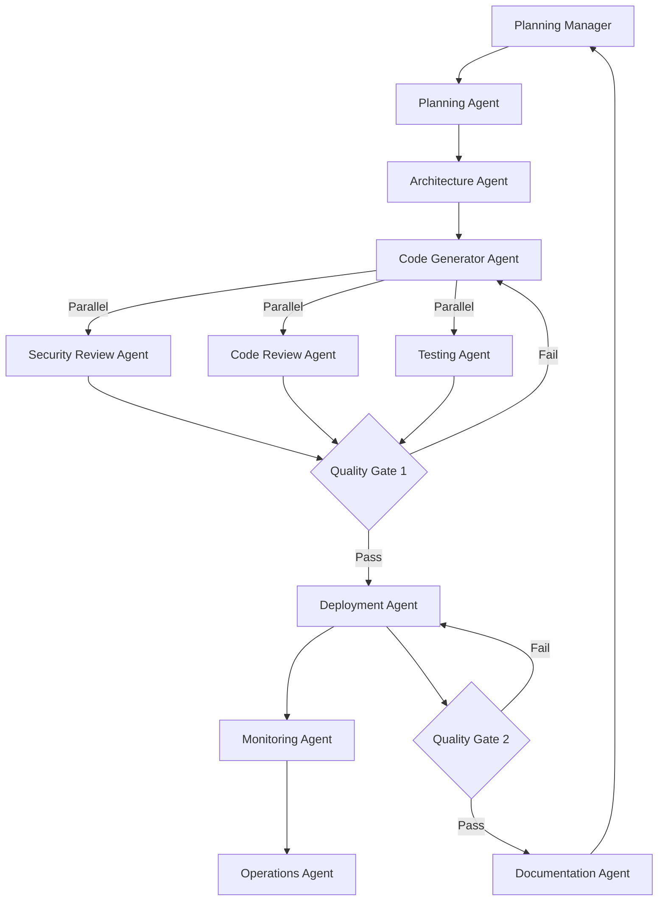

# Multi-Agent Architecture for TraderX ConfigHub Implementation

## Executive Summary

This document outlines a multi-agent orchestration system for implementing TraderX on ConfigHub. By dividing responsibilities among specialized agents, we achieve parallel execution, quality gates, and reduced implementation time from 16+ hours to ~10 hours.

## Agent Architecture



## Agent Definitions

### 1. Planning Agent 🎯
**Role**: Strategic Planning & Requirements Analysis

**Responsibilities**:
- Analyze TraderX architecture (8 microservices)
- Define deployment phases
- Create acceptance criteria
- Identify risks and dependencies

**Output**:
- `IMPLEMENTATION-PLAN.md`
- `RISK-MATRIX.md`
- `SUCCESS-CRITERIA.md`

**Tools**: Task, WebFetch, TodoWrite

---

### 2. Architecture Agent 🏗️
**Role**: Technical Design & Pattern Selection

**Responsibilities**:
- Design ConfigHub space hierarchy
- Select canonical patterns to use
- Define service dependencies
- Create deployment topology

**Output**:
- `ARCHITECTURE-DESIGN.md`
- `confighub/topology.yaml`
- `bin/dependency-map.json`

**Tools**: Read, Write

---

### 3. Code Generator Agent 💻
**Role**: Implementation & Script Generation

**Responsibilities**:
- Generate bin/ scripts
- Create YAML manifests
- Implement ConfigHub patterns
- Add error handling

**Output**:
- `bin/install-base`
- `bin/install-envs`
- `confighub/base/*.yaml`
- `bin/promote`

**Tools**: Write, Edit, Bash

---

### 4. Security Review Agent 🔐
**Role**: Security Analysis & Compliance

**Responsibilities**:
- Review credentials handling
- Check RBAC configurations
- Validate secret management
- Ensure no hardcoded tokens

**Output**:
- `SECURITY-REVIEW.md`
- `security/rbac.yaml`
- `security/policies.json`

**Tools**: Grep, Read

---

### 5. Code Review Agent 👁️
**Role**: Quality Assurance & Best Practices

**Responsibilities**:
- Review shell script quality
- Check YAML formatting
- Validate ConfigHub patterns
- Ensure idempotency

**Output**:
- `CODE-REVIEW.md`
- Suggested fixes
- Performance recommendations

**Tools**: Read, Bash

---

### 6. Testing Agent 🧪
**Role**: Validation & Quality Assurance

**Responsibilities**:
- Create unit tests
- Run integration tests
- Validate deployment order
- Test rollback procedures

**Output**:
- `test/unit/*.sh`
- `test/integration/*.sh`
- `TEST-RESULTS.md`

**Tools**: Bash, Write

---

### 7. Deployment Agent 🚀
**Role**: Execution & Environment Setup

**Responsibilities**:
- Execute install-base
- Deploy to dev environment
- Validate deployment
- Set up workers

**Output**:
- Deployed services
- `DEPLOYMENT-LOG.md`
- Worker configurations

**Tools**: Bash, BashOutput

---

### 8. Monitoring Agent 📊
**Role**: Observability & Alerting

**Responsibilities**:
- Set up health checks
- Configure metrics
- Create dashboards
- Set up alerts

**Output**:
- `monitoring/dashboards.json`
- `monitoring/alerts.yaml`
- `MONITORING-SETUP.md`

**Tools**: Write, WebFetch

---

### 9. Documentation Agent 📚
**Role**: Documentation & Knowledge Management

**Responsibilities**:
- Update README.md
- Create runbooks
- Document troubleshooting
- Maintain changelog

**Output**:
- Updated documentation
- `RUNBOOK.md`
- `CHANGELOG.md`

**Tools**: Edit, Write

## Execution Sequence

### Phase 1: Planning & Design (Sequential)
```
1. Planning Agent → Creates implementation plan (2 hours)
2. Architecture Agent → Designs technical architecture (1 hour)
```

### Phase 2: Implementation (Iterative)
```
3. Code Generator Agent → Creates initial implementation (3 hours)
4. Loop until quality gates pass:
```

### Phase 3: Parallel Review & Testing
```
Parallel execution:
- Security Review Agent → Reviews security (30 min)
- Code Review Agent → Reviews code quality (30 min)
- Testing Agent → Runs tests (45 min)
```

### Quality Gate 1
```
If all pass → Continue to Phase 4
If any fail → Return to Code Generator with feedback
```

### Phase 4: Deployment (Sequential)
```
5. Deployment Agent → Deploy to dev (30 min)
6. Monitoring Agent → Set up monitoring (30 min)
```

### Quality Gate 2
```
If deployment successful → Continue to Phase 5
If deployment fails → Debug and retry
```

### Phase 5: Documentation (Final)
```
7. Documentation Agent → Update all docs (1 hour)
```

## Inter-Agent Communication Protocol

### Message Format
```yaml
AgentMessage:
  from: SecurityReviewAgent
  to: CodeGeneratorAgent
  type: FEEDBACK
  severity: CRITICAL
  content:
    issue: "Hardcoded token found in setup-worker"
    file: bin/setup-worker
    line: 109
    suggestion: "Use cub auth get-token dynamically"
```

### Communication Channels
```yaml
Channels:
  - feedback: Agents → Code Generator
  - status: All Agents → Planning Manager
  - alerts: Critical issues → All Agents
  - results: Testing/Deployment → Documentation
```

## Quality Gates

### Quality Gate 1: Pre-Deployment
```yaml
Criteria:
  Security:
    - No hardcoded secrets: PASS
    - RBAC configured: PASS
    - Network policies: PASS

  Code Quality:
    - Shellcheck passed: PASS
    - YAML valid: PASS
    - Idempotent scripts: PASS

  Testing:
    - Unit tests: 100% pass
    - Integration tests: 100% pass
    - Dependency order: Validated

Action:
  All PASS → Proceed to deployment
  Any FAIL → Return to Code Generator
```

### Quality Gate 2: Post-Deployment
```yaml
Criteria:
  Deployment:
    - All services running: YES
    - Health checks passing: YES
    - Worker active: YES

  Monitoring:
    - Metrics flowing: YES
    - Alerts configured: YES
    - Dashboards accessible: YES

Action:
  All YES → Update documentation
  Any NO → Troubleshoot and fix
```

## Agent Invocation Commands

```bash
# Launch Planning Agent
cub task create \
  --agent planning \
  --prompt "Plan TraderX ConfigHub implementation for 8 microservices"

# Launch Architecture Agent
cub task create \
  --agent architecture \
  --prompt "Design ConfigHub topology for TraderX with dependencies"

# Launch Code Generator Agent
cub task create \
  --agent code-generator \
  --prompt "Generate ConfigHub scripts and manifests for TraderX"

# Launch parallel review agents
cub task create --parallel \
  --agent security-review \
  --agent code-review \
  --agent testing

# Launch Deployment Agent
cub task create \
  --agent deployment \
  --prompt "Deploy TraderX to dev environment"
```

## Success Metrics

### Planning Phase
- ✅ Clear phases defined
- ✅ All dependencies identified
- ✅ Risk mitigation planned

### Implementation Phase
- ✅ 100% ConfigHub native
- ✅ Zero kubectl commands
- ✅ All patterns implemented

### Quality Phase
- ✅ Security review passed
- ✅ Code review passed
- ✅ Tests passing: 100%

### Deployment Phase
- ✅ Dev environment: Running
- ✅ Staging promotion: Successful
- ✅ Production ready: Yes

### Operations Phase
- ✅ Monitoring active
- ✅ Documentation complete
- ✅ Runbooks available

## Implementation Timeline

```
Hour 0-2:   Planning Agent analyzes and plans
Hour 2-3:   Architecture Agent designs system
Hour 3-6:   Code Generator creates implementation
Hour 6-7:   Parallel reviews and testing
Hour 7-8:   Deployment to dev environment
Hour 8-9:   Monitoring setup and validation
Hour 9-10:  Documentation and handoff

Total: 10 hours with parallel execution
Sequential would take: 16+ hours
```

## Benefits of Multi-Agent Approach

### Speed
- **40% faster** through parallel execution
- Reviews happen simultaneously, not sequentially
- Quality gates prevent rework

### Quality
- **Specialized expertise** per agent
- Security review catches vulnerabilities early
- Testing prevents deployment failures

### Scalability
- Agents can be reused for other projects
- Easy to add new agents (e.g., Performance Agent)
- Patterns become reusable templates

### Auditability
- Complete trace of decisions
- Clear handoffs between agents
- Quality gate documentation

## Implementation with Claude Code

### Using Task Tool for Agents
```bash
# Example: Launch Planning Agent
Task(
  subagent_type="general-purpose",
  description="Plan TraderX implementation",
  prompt="""
    Analyze the TraderX application with 8 microservices and create a
    comprehensive implementation plan for ConfigHub deployment. Include:
    1. Deployment phases
    2. Risk analysis
    3. Success criteria
    4. Timeline estimates
  """
)
```

### Parallel Agent Execution
```bash
# Launch three review agents in parallel
[
  Task(subagent_type="general-purpose", description="Security review"),
  Task(subagent_type="general-purpose", description="Code review"),
  Task(subagent_type="general-purpose", description="Run tests")
]
```

## Next Steps

1. **Validate agent architecture** with small proof-of-concept
2. **Create agent templates** for reusability
3. **Implement communication protocol** between agents
4. **Set up quality gate automation**
5. **Run pilot with Planning and Architecture agents**
6. **Iterate based on results**
7. **Full implementation** with all 9 agents

## Conclusion

This multi-agent approach transforms TraderX implementation from a monolithic task into a well-orchestrated, parallel process with built-in quality gates. The result is faster delivery, higher quality, and complete auditability.

The specialized nature of each agent ensures expertise is applied at the right time, while parallel execution significantly reduces overall implementation time. Quality gates prevent bad code from reaching production, and comprehensive documentation ensures maintainability.

This architecture is not just for TraderX - it becomes a template for all future ConfigHub deployments, making each successive implementation faster and more reliable.